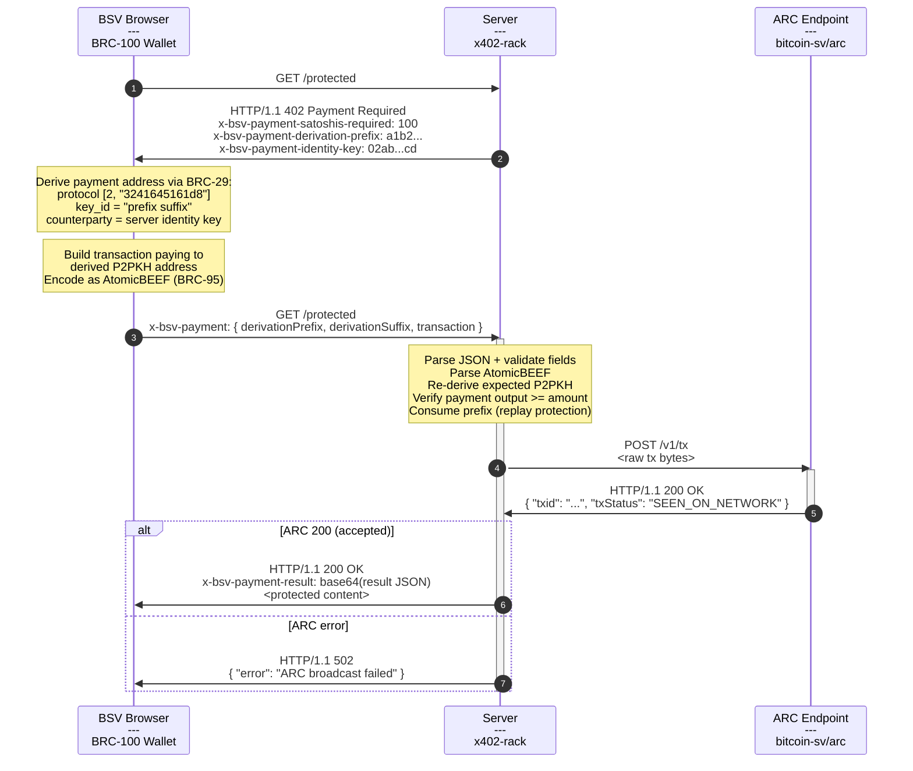
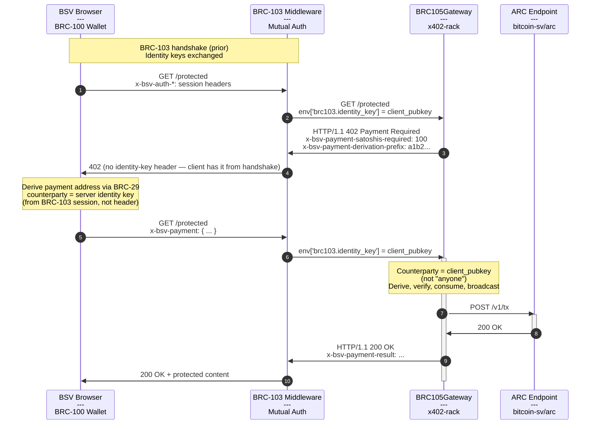

# BRC105Gateway Process Flow

## Sequence (Standalone Mode)

```
 Flow        | N | From    →  To      |   | HTTP                           | x-bsv Headers                                    | Body
-------------|---|-------------------|---|--------------------------------|-------------------------------------------------|-----------------------------
  │          | 1 | client  →  server |   | GET /protected                 |                                                  |
 402         | 2 | server  →  client | ⚠ | HTTP/1.1 402 Payment Required  | x-bsv-payment-satoshis-required: 100             | { "error": "Payment Required" }
  │          |   |                    |   |                                | x-bsv-payment-derivation-prefix: a1b2...         |
  │          |   |                    |   |                                | x-bsv-payment-identity-key: 02ab...cd            |
  │          | 3 | client  →  server |   | GET /protected                 | x-bsv-payment: [1]                               |
  │          | 4 | server  →  ARC    |   | POST /v1/tx                    |                                                  | <raw tx bytes>
  ├─ 200     | 5 | ARC     →  server |   | HTTP/1.1 200                   |                                                  | { "txid": "...", ... }
  │   └─ 200 | 6 | server  →  client |   | HTTP/1.1 200 OK                | x-bsv-payment-result: [2]                        | <protected content>
  └─ XXX     | 7 | ARC     →  server | ✗ | HTTP/1.1 XXX ...               |                                                  | { "status": XXX, ... }
      └─ 502 | 8 | server  →  client | ✗ | HTTP/1.1 502                   |                                                  | { "error": "ARC broadcast failed" }

Key:

[1] JSON: { "derivationPrefix": "a1b2...", "derivationSuffix": "f7e8...", "transaction": "<base64 AtomicBEEF>" }
[2] base64(JSON: { "success": true, "transaction": "<txid>", "network": "bsv:mainnet" })

⚠ Expected (402 Challenge)
✗ ARC rejection
```

## Sequence Diagram (Standalone Mode)



## Sequence Diagram (Authenticated Mode — with BRC-103)



## Notes

- **Server broadcasts, not client** — like PayGateway. The server receives the AtomicBEEF and broadcasts.
- **No partial template** — unlike PayGateway and ProofGateway, the server does not provide a pre-built transaction. The client derives the payment address and builds the entire transaction.
- **No OP_RETURN** — request binding is implicit via the derivation prefix (unique per challenge, server-tracked).
- **AtomicBEEF** — transactions are in BRC-95 format (includes merkle proofs), not raw bytes.
- **Prefix consumed after validation** — the derivation prefix is consumed only after BEEF parsing, derivation verification, and payment output checks. This prevents a MITM from burning a legitimate prefix with garbage.
- **BRC-103 detection is automatic** — the gateway checks `env['brc103.identity_key']` for a valid compressed pubkey hex. If present, authenticated mode; otherwise, standalone.
