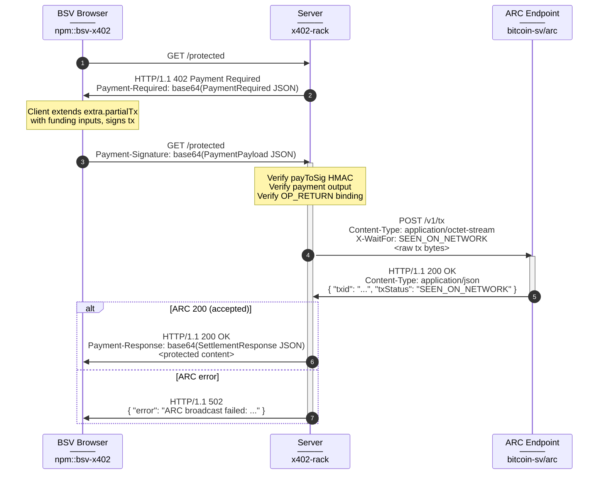

# PayGateway Process Flow

## Sequence


```
 Flow       | N | From    → To      |   | HTTP                           | Content-Type             | x402 Headers              | Body
------------|---|-------------------|---|--------------------------------|--------------------------|---------------------------|-----------------------------
 │          | 1 | client  →  server |   | GET /protected                 |                          |                           |
 402        | 2 | server  →  client | ⚠ | HTTP/1.1 402 Payment Required  | application/json         | Payment-Required: [1]     | { "error": "Payment Required" }
 │          | 3 | client  →  server |   | GET /protected                 |                          | Payment-Signature: [2]    |
 │          | 4 | server  →  ARC    |   | POST /v1/tx                    | application/octet-stream |                           | <raw tx bytes>
 ├─ 200     | 5 | ARC     →  server |   | HTTP/1.1 200                   | application/json         |                           | { "txid": "c0d6...5a6", ... }
 │   └─ 200 | 6 | server  →  client |   | HTTP/1.1 200 OK                | application/json         | Payment-Response: [3]     | { "data": "..." }
 └─ XXX     | 7 | ARC     →  server | ✗ | HTTP/1.1 XXX ...               | application/json         |                           | { "status": XXX, "title": "..." }
     └─ 502 | 8 | server  →  client | ✗ | HTTP/1.1 502                   | application/json         |                           | { "error": "ARC broadcast failed: ..." }

Key:

[1] base64(PaymentRequired JSON) — Coinbase v2 format with accepts array, extra.partialTx, extra.payToSig
[2] base64(PaymentPayload JSON)  — accepted block + payload.rawtx + payload.txid
[3] base64(SettlementResponse JSON) — success, transaction, network

⚠ Expected (402 Challenge)
✗ ARC rejection
```


## Sequence Diagram



## Notes

- **Server broadcasts, not client** — PayGateway follows the BSV convention where the payee settles.
- **payToSig HMAC** — the challenge includes an HMAC of the `payTo` field signed with a server-side secret. Prevents clients from substituting their own payee address.
- **OP_RETURN binding** — `OP_FALSE OP_RETURN "x402" SHA256(method + path + query)` binds the payment to the specific HTTP request.
- **extra.partialTx** — progressive enhancement. Smart clients extend the pre-built template; basic clients construct from `payTo` + `amount`.
- **ARC X-WaitFor** — defaults to `SEEN_ON_NETWORK` (tx propagated). Configurable per gateway.
