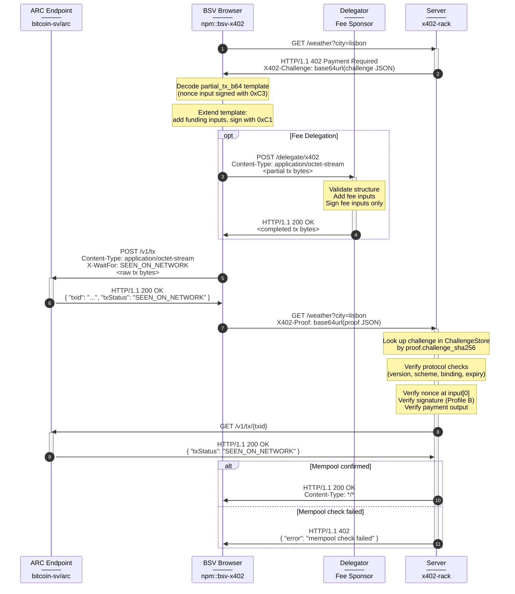

# ProofGateway Process Flow

## Sequence

```
 Flow       | N | From    → To        |   | HTTP                           | Content-Type             | x402 Headers              | Body
------------|---|---------------------|---|--------------------------------|--------------------------|---------------------------|-----------------------------
  │          | 1 | client  →  server   |   | GET /weather?city=lisbon       |                          |                           |
 402         | 2 | server  →  client   | ⚠ | HTTP/1.1 402 Payment Required  | application/json         | X402-Challenge: [1]       | { "error": "Payment Required" }
  │          | 3 | client  →  deleg.   |   | POST /delegate/x402            | application/octet-stream |                           | <partial tx bytes>
  │          | 4 | deleg.  →  client   |   | HTTP/1.1 200                   | application/octet-stream |                           | <completed tx bytes>
  │          | 5 | client  →  ARC      |   | POST /v1/tx                    | application/octet-stream | X-WaitFor: SEEN_ON_NETWORK| <raw tx bytes>
  ├─ 200     | 6 | ARC     →  client   |   | HTTP/1.1 200                   | application/json         |                           | { "txid": "c0d6...5a6", ... }
  │   │      | 7 | client  →  server   |   | GET /weather?city=lisbon       |                          | X402-Proof: [2]           |
  │   ├─ 200 | 8 | server  →  client   |   | HTTP/1.1 200 OK                | */*                      |                           | <protected content>
  │   └─ 402 | 9 | server  →  client   | ✗ | HTTP/1.1 402                   | application/json         | X402-Challenge: [1]       | { "error": "mempool check failed" }
  └─ XXX     |10 | ARC     →  client   | ✗ | HTTP/1.1 XXX ...               | application/json         |                           | { "status": XXX, "title": "..." }

Key:

[1] base64url(challenge JSON) — merkleworks format with nonce UTXO, request binding, partial_tx_b64 (Profile B)
[2] base64url(proof JSON)     — challenge_sha256 + payment.rawtx_b64 + payment.txid

⚠ Expected (402 Challenge)
✗ Rejection (ARC or mempool)
```

## Sequence Diagram



## Notes

- **Client broadcasts, not server** — broadcasting is settlement, not authorisation. Keeps the server stateless (per Rui at merkleworks).
- **Profile B template** — the treasury (via `nonce_provider`) builds and signs the template. The gateway appends the OP_RETURN and includes it in the challenge as `partial_tx_b64`. The nonce input at index 0 is signed with `0xC3`. The client extends it by appending funding inputs.
- **0xC3 sighash** — `SIGHASH_SINGLE | ANYONECANPAY | FORKID` commits to output 0 (payment) while allowing additional inputs and outputs. See [architecture.md](../architecture.md#why-0xc3-for-the-nonce-signature).
- **Fee delegation is optional** — shown as `opt` in the diagram. Most clients can fund their own fees (1-50 sats). The delegator adds fee inputs and signs only those.
- **Client signs with 0xC1** — `SIGHASH_ALL | ANYONECANPAY | FORKID` on funding inputs. Commits to all outputs but allows the delegator to append fee inputs.
- **Challenge cache** — the client only echoes `challenge_sha256` in the proof (per the merkleworks spec). The server recovers the original challenge from a per-instance TTL-bounded `ChallengeStore` keyed by that hash. A cache miss rejects the proof before any downstream check runs. The entry is consumed on successful settlement, killing same-proof replay.
- **Nonce provenance (Profile B)** — the server verifies the signature on input 0 via the SDK's script interpreter (`verify_input(0)`). Proves the server issued the nonce.
- **Request binding** — the challenge includes `SHA256(method + path + query + headers + body)` hashes. Verified against the current request at settlement.
